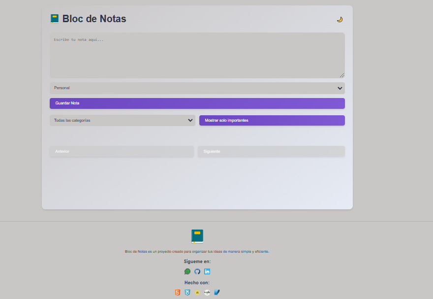
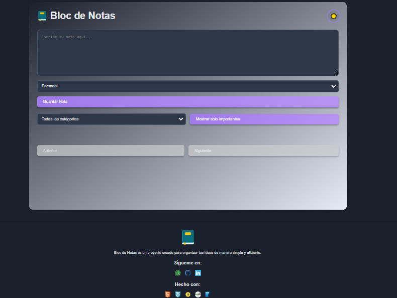

# Título del Proyecto


## Descripción

Breve explicación de qué hace tu proyecto y por qué es útil.

## Instalación

Pasos para instalar y ejecutar el proyecto:

```bash
git clone https://github.com/usuario/repo.git
cd repo
npm install
npm start

Uso
Instrucciones claras sobre cómo usar el proyecto.

Contribuciones
¡Contribuciones son bienvenidas! Por favor, sigue las normas del repositorio.

Licencia
Este proyecto está bajo la Licencia MIT. Para más detalles, revisa LICENSE.md.



